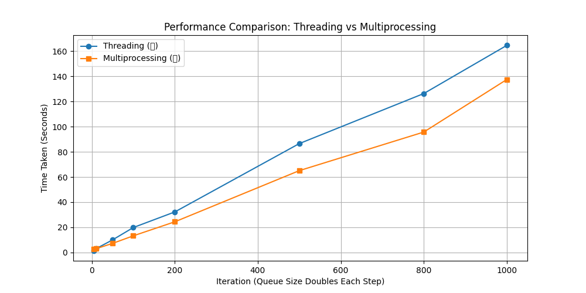

# **Concurrency Project - Multithreading vs Multiprocessing**

## **Overview**
This project compares **multithreading** and **multiprocessing** for handling **matrix multiplication** tasks.  
The goal is to analyze which method performs better under increasing workloads.

## **Implementation**
- **Multithreading**: Uses Python’s `threading` module to process matrix multiplications.
- **Multiprocessing**: Uses Python’s `multiprocessing` module to utilize multiple CPU cores.
- **Queue System**: Tasks are pushed into a queue and processed in parallel.

## **Performance Graph**
Below is the **performance comparison** of threading vs. multiprocessing as queue size increases:

- **🔵 Threading** scales poorly due to the Global Interpreter Lock (GIL).
- **🔴 Multiprocessing is significantly faster** as queue size increases.
